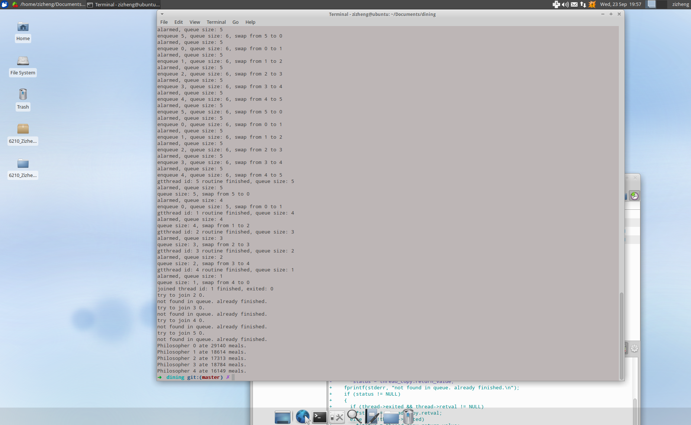

#GTThreads — a preemptive user-level thread package with an API similar to Pthreads
Zizheng Wu
----------------------

# Implemented APIs

    void gtthread_init(long period);
    int  gtthread_create(gtthread_t *thread,
                         void *(*start_routine)(void *),
                         void *arg);
    int  gtthread_join(gtthread_t thread, void **status);
    void gtthread_exit(void *retval);
    int  gtthread_yield(void);
    int  gtthread_equal(gtthread_t t1, gtthread_t t2);
    int  gtthread_cancel(gtthread_t thread);
    gtthread_t gtthread_self(void);
    
    int  gtthread_mutex_init(gtthread_mutex_t *mutex);
    int  gtthread_mutex_lock(gtthread_mutex_t *mutex);
    int  gtthread_mutex_unlock(gtthread_mutex_t *mutex);

# What Linux platform do you use?
The code is developed under Xubuntu.

    Distributor ID: Ubuntu
    Description:  Ubuntu 12.04.5 LTS
    Release:  12.04
    Codename: precise

# How the preemptive scheduler is implemented.
`SIGVTALRM` is raised by a timer regarding the interval passed to `gtthread_init`. On cathing `SIGVTALRM`, the scheduler will perform `swapcontext` between the current thread and the next thread in queue.

# How to compile your library and run your program.
Specifically, I have attached a solution to the Dining Philosophers problem using my implementation of GTThreads.

To run, `make && ./dining_main` .

A picture:

# How you prevent deadlocks in your Dining Philosophers solution.
I applied the resource hierarchy solution. I numbered all the chopsticks. Every philosopher must pickup the lower-numbered fork first, and then the higher-numbered fork. 

# Any thoughts you have on the project, including things that work especially well or which don't work.
* good: I believe I gave an elegant implementation. Context swapping is performed by `alrm_handler` only. Every time when there is a need to swapcontext, I just `raise(SIGVTALRM);`. This will keep the logic of the program clear.
* bad: The program hasn't been tested thouroughly though it passed all the tests on Udacity. I suspect that boundary cases might break my library.
